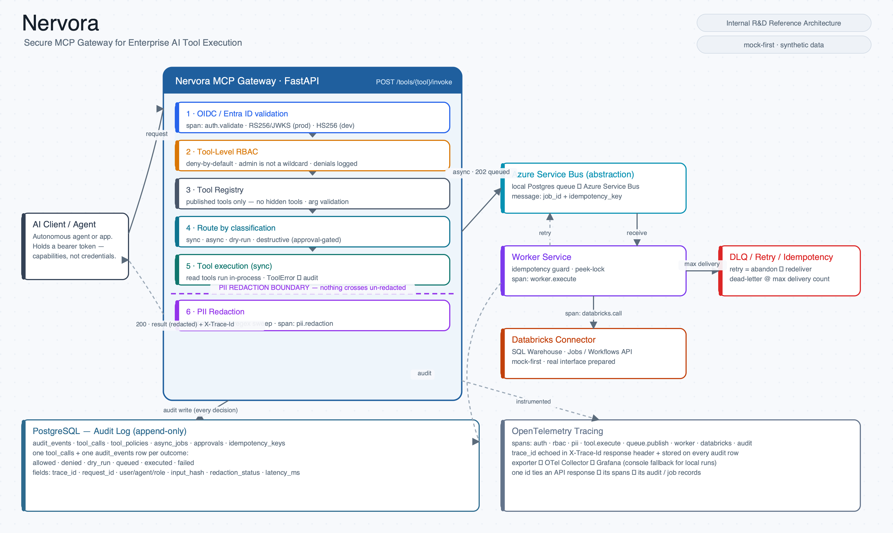

# Nervora

**Secure MCP Gateway for Enterprise AI Tool Execution**
*Internal R&D Reference Architecture*

A production-grade reference implementation showing how enterprise AI agents can
call real business tools **safely**, through a governed FastAPI / MCP-style
integration layer. It is deliberately not a chatbot demo — it is a demonstration
of the *control plane* that has to sit between an autonomous agent and your
systems of record: authentication, tool-level RBAC, audit logging, PII
redaction, dry-run for destructive actions, async execution with idempotency,
retry/DLQ handling, Databricks integration, OpenTelemetry tracing, and
Azure-deployment readiness.

> Status: Internal R&D reference architecture. Mock-first by design (no real
> production systems are touched). Suitable for public GitHub and as a DACH-facing
> technical trust signal on inovativi.com.



---

## What this project proves

- An AI agent can be given **capabilities, not credentials**. It calls named,
  declared tools; it never holds a database connection or a Databricks token.
- **Every** tool call is authenticated, authorised against tool-level RBAC,
  PII-redacted, and audited — including the calls that are *denied*.
- Destructive actions are **deny-by-default**: they require an explicit
  human-approved token and are hard-disabled in demo mode.
- Long-running work is **decoupled** onto a queue with an idempotency key, a
  worker, retries and a dead-letter path — agents cannot run long jobs
  synchronously, and duplicate submissions cannot double-execute.
- The whole thing is **observable** (OpenTelemetry spans around every stage,
  trace ids echoed into responses and audit rows) and **portable** (one
  abstraction for the queue, one for Databricks — local mock today, Azure
  Service Bus / Databricks tomorrow with a config change).

## What this project deliberately does **not** do

- It does not ship a model or an agent reasoning loop. The "agent" is a thin
  client; the value here is the gateway, not the LLM.
- It does not connect to real HR/finance/CRM systems. Tool data is synthetic.
- The Databricks and Azure Service Bus connectors run as **mocks/local
  backends** by default; the real implementations are present as prepared
  interfaces, not exercised in the demo.
- It is not a turnkey production deployment. The IaC under `infra/` is reference
  material — networking, secret management (Key Vault) and identity hardening
  are called out but not fully implemented.

See [docs/judgment-block.md](docs/judgment-block.md) for the explicit list of
things agents are **not allowed** to do.

---

## Architecture

```
                         ┌──────────────────────────────────────────────┐
   AI Agent  ──Bearer──▶ │             Nervora MCP Gateway (FastAPI)      │
   (demo-agent)          │                                                │
                         │  auth ─▶ RBAC ─▶ args ─▶ route ─▶ PII ─▶ audit │
                         └───┬───────────────┬───────────────┬───────────┘
                             │ sync           │ async          │ writes
                             ▼                ▼                ▼
                     Databricks (mock) │  Service Bus     │  PostgreSQL
                     SQL + Jobs API    │  (local | azure) │  audit_events
                                       │      │           │  tool_calls
                                       │      ▼           │  tool_policies
                                       │   Worker ────────┤  async_jobs
                                       │   idempotency    │  approvals
                                       │   retry / DLQ    │  idempotency_keys
                                       └──────┬───────────┘
                                              ▼
                                  OpenTelemetry  ─▶ Collector ─▶ Grafana
```

Full detail: [docs/architecture.md](docs/architecture.md).

### Repository layout

```
apps/
  mcp-gateway/     FastAPI gateway: the governed execution pipeline + API
  worker/          Async job worker: idempotency, retry, dead-letter
  demo-agent/      CLI client that mints dev tokens and runs the scripted demo
  admin-web/       Static, read-only operator console (tools, queue, audit)
packages/
  common/          Settings + id/hash helpers shared by every service
  auth/            OIDC/JWT abstraction (dev HS256 + Entra ID RS256/JWKS)
  rbac/            Roles + deny-by-default tool-level policy evaluation
  audit/           SQLAlchemy schema + the only sanctioned audit writer
  pii/             Field-level + pattern-based redaction
  telemetry/       OpenTelemetry tracer setup + span helpers
  tool_registry/   ToolSpec metadata + the 7 reference tools
  databricks_connector/  Mock + prepared-real SQL / Jobs connector
  servicebus/      Queue abstraction: local Postgres backend + Azure Service Bus
infra/
  docker-compose.yml   Local stack (postgres, gateway, worker, otel, grafana, web)
  terraform/ | bicep/  Azure reference deployment
  grafana/             Dashboard + provisioning
docs/                  Architecture, security model, RBAC matrix, demo script…
tests/                 Pytest suite (RBAC, PII, tools, async/idempotency, API)
```

---

## Security flow

Every call to `POST /tools/{tool_name}/invoke` runs this fixed pipeline
(each stage is its own OpenTelemetry span):

1. **Authenticate** — validate the bearer token (dev HS256 locally, Entra ID
   JWKS/RS256 in production) → `Principal{subject, agent_id, role}`.
2. **Authorise (RBAC)** — deny-by-default; the role must be explicitly listed in
   the tool's `required_roles`. Admin is **not** a wildcard. Denials are logged.
3. **Validate** — arguments are validated against the tool's pydantic schema.
4. **Route** by classification / execution mode:
   - *destructive* → deny unless tool enabled **and** a valid approval token
     **and** an approved approval record exist;
   - *dry-run-required* → execute the read-only diff, create a `pending`
     approval, return "human approval required";
   - *async* → reserve idempotency key, create job, publish to the queue (202);
   - *sync read/write* → execute.
5. **Redact PII** — sensitive fields are masked before the output is
   model-visible, unless policy + role allow raw access. A regex sweep catches
   leaks in free-text.
6. **Audit** — one `tool_calls` row + one `audit_events` row are written for
   **every** outcome, with trace id, input hash, decision, redaction status,
   error code and latency.

Details: [docs/security-model.md](docs/security-model.md).

---

## RBAC matrix

| Tool | Class | Mode | HR | Finance | Sales | Admin |
|------|-------|------|:--:|:------:|:-----:|:-----:|
| `get_employee_profile` | read (PII) | sync | ✅ | – | – | ✅ |
| `check_leave_balance` | read | sync | ✅ | – | – | ✅ |
| `get_invoice_status` | read | sync | – | ✅ | – | ✅ |
| `run_budget_variance_report` | read | sync | – | ✅ | – | ✅ |
| `trigger_databricks_workflow` | write | **async** | – | ✅ | – | ✅ |
| `create_crm_update_dry_run` | write (dry-run) | sync | – | – | ✅ | ✅ |
| `execute_crm_update` | **destructive** | sync | – | – | – | ✅* |

`*` disabled in demo mode and gated by an approval token even when enabled.
Full matrix incl. PII class and dry-run flags: [docs/rbac-matrix.md](docs/rbac-matrix.md).

---

## Local setup

Requirements: Docker + Docker Compose. (For running tests/agents directly:
**Python 3.12 recommended** — `make install` then `make test`. If your default
`python3` is a different version, point the Makefile at a 3.12 interpreter, e.g.
`make test PY=.venv/bin/python`.)

```bash
cp .env.example .env

# Full stack: gateway, worker, postgres, otel-collector, grafana, admin-web
make up
# or: docker compose -f infra/docker-compose.yml up --build
```

Then:

- API docs (Swagger): <http://localhost:8000/docs>
- Admin console: <http://localhost:8080>
- Grafana: <http://localhost:3000> (anonymous admin)

Run the scripted demo against the running stack:

```bash
make demo          # or: GATEWAY_URL=http://localhost:8000 python apps/demo-agent/agent.py demo
make token ROLE=finance_agent   # mint a dev bearer token for manual curl/Swagger
```

Run the tests (SQLite-backed, no Docker needed):

```bash
make install       # editable install incl. dev deps
make test          # 33 tests: RBAC, PII, tools, async/idempotency, HTTP API
make lint
```

---

## Demo script (5–7 min)

A finance agent runs an allowed report, triggers an async Databricks workflow
(queued → worker → succeeded), a duplicate submission is de-duplicated by
idempotency key, a sales agent is **denied** HR access and **blocked** from a
destructive write, and the full audit trail is shown. Step-by-step narration in
[docs/demo-script.md](docs/demo-script.md).

---

## Azure deployment notes

Production swaps three things via configuration, no code changes:

- `AUTH_MODE=entra` → tokens validated against Entra ID tenant JWKS (RS256).
- `QUEUE_BACKEND=azure` → Azure Service Bus (native peek-lock + DLQ).
- `DATABRICKS_MODE=real` → real SQL Statement Execution + Jobs APIs.

Container Apps + PostgreSQL Flexible Server + Service Bus + Application Insights
are provisioned by `infra/terraform` or `infra/bicep`. See
[docs/azure-deployment.md](docs/azure-deployment.md).

---

## Observability

OpenTelemetry spans wrap auth, RBAC, PII redaction, tool execution, queue
publish, worker execution, the Databricks call and every audit write. The trace
id is returned in the `X-Trace-Id` response header and stored on every audit
row, so a single id ties an API response to its spans and its audit records.
Grafana dashboard JSON and setup notes: [docs/observability.md](docs/observability.md).

---

## Screenshots checklist

What to capture for the portfolio / inovativi.com write-up:
[docs/screenshots.md](docs/screenshots.md). Website-ready case-study copy:
[docs/inovativi-case-study.md](docs/inovativi-case-study.md).

---

## Honest limitations

- Mock-first: Databricks and Service Bus run as local/mock backends by default;
  the real connectors are prepared interfaces, not battle-tested.
- The local queue is a faithful but simple Postgres-backed stand-in, not a
  high-throughput broker.
- Dev tokens use HS256 with a shared secret for local convenience; this path is
  never used in production (Entra ID JWKS is).
- PII redaction is policy- + regex-based; it is defence-in-depth, not a
  guarantee against every possible leak vector.
- IaC is reference-grade; production networking/secret/identity hardening is
  documented but not fully implemented.

## Roadmap

- Real Databricks connector implementation + integration tests behind a flag.
- KEDA queue-length autoscaling for the worker on Container Apps.
- Native MCP transport (stdio / streamable HTTP) in front of the tool registry.
- Policy-as-code (OPA/Rego) alternative to the in-code RBAC matrix.
- Approval workflow UI + signed, expiring approval tokens.
- Tempo/Jaeger trace backend wired into the Grafana dashboard out of the box.

---

## License

Apache-2.0. Reference/educational use. Synthetic data only.
