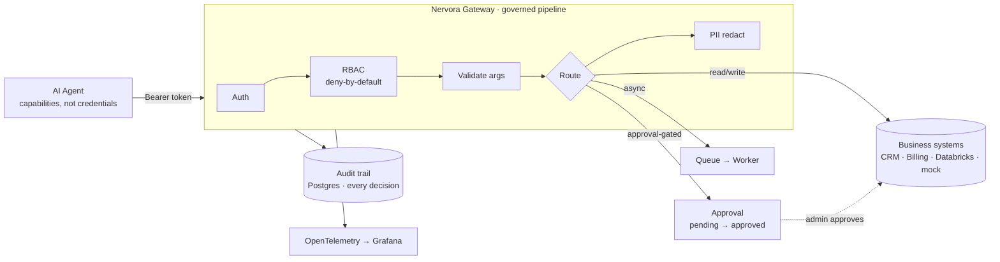

# Nervora — Demo Walkthrough

A five-minute, technical tour of what the Phase 1 reference architecture proves.

> **Positioning.** Nervora is **not** an LLM wrapper or a generic agent
> framework. It is the **controlled execution layer between AI agents and real
> business systems** — the part that decides whether a tool call is allowed,
> whether it needs human approval, what gets redacted, and what gets recorded.

---

## 1. What Nervora demonstrates

An AI agent is given **capabilities, not credentials**. It calls named, declared
tools over HTTP; it never holds a database connection, an invoice-system token,
or a CRM password. Every call passes through one governed pipeline:

- **Authenticated** — a verified `Principal{subject, agent_id, role}`.
- **Authorised** — tool-level RBAC, deny-by-default (admin is *not* a wildcard).
- **Validated** — arguments checked against the tool's schema.
- **Routed** — read / write / approval-gated / async handled differently.
- **Redacted** — PII masked before it becomes model-visible.
- **Audited** — one durable record per decision, *including denials*.

The result every time is a deterministic JSON envelope plus an audit trail entry.

## 2. Architecture (Mermaid)



Every stage is its own OpenTelemetry span; the trace id is echoed in the
`X-Trace-Id` response header and stored on every audit row.

## 3. Demo flow

Using the two Phase 1 demo tools, the shortest path that shows the control plane
doing its job:

1. A **sales agent** looks up a customer → allowed → PII redacted → audited.
2. A **finance agent** tries the same lookup → **denied by RBAC** → the denial
   is audited too.
3. A **finance agent** drafts an invoice → **approval gate** engages: nothing is
   written, a pending `approval_id` is returned.
4. An **admin** approves it → the approval flips to `approved`.
5. `GET /health/ai` shows backing services and the full tool surface.

## 4. Example request — `crm.lookup_customer` (allowed)

```bash
curl -s -X POST localhost:8000/tools/crm.lookup_customer/invoke \
  -H "Authorization: Bearer $SALES_TOKEN" \
  -H "Content-Type: application/json" \
  -d '{"arguments": {"customer_id": "CUST-700"}}'
```

```json
{
  "tool": "crm.lookup_customer",
  "decision": "executed",
  "result": {
    "customer_id": "CUST-700",
    "name": "Helvetia Logistics AG",
    "tier": "silver",
    "email": "***REDACTED***",
    "phone": "***REDACTED***",
    "billing_currency": "EUR"
  },
  "redaction": { "status": "redacted", "redacted_fields": ["email", "phone"] },
  "trace_id": "…", "request_id": "…", "latency_ms": 3.1
}
```

Note the agent receives the business data it needs — but the contact PII is
masked by policy, not by the agent's good behaviour.

## 5. Example denied request — RBAC

The same tool, called by a `finance_agent` whose role is not on the tool's
`required_roles`:

```bash
curl -s -o /dev/null -w "%{http_code}\n" -X POST \
  localhost:8000/tools/crm.lookup_customer/invoke \
  -H "Authorization: Bearer $FINANCE_TOKEN" \
  -d '{"arguments": {"customer_id": "CUST-700"}}'
# 403
```

```json
{
  "tool": "crm.lookup_customer",
  "decision": "denied",
  "error_code": "role_not_permitted",
  "message": "role 'finance_agent' is not permitted; requires one of ['admin_agent', 'sales_agent']",
  "trace_id": "…"
}
```

No tool code ran. The denial is still written to the audit trail.

## 6. Example approval-gated request — `billing.create_invoice_draft`

A write that must not happen autonomously. The draft is computed but **nothing
is committed**; the response carries a pending approval id.

```bash
curl -s -X POST localhost:8000/tools/billing.create_invoice_draft/invoke \
  -H "Authorization: Bearer $FINANCE_TOKEN" \
  -d '{"arguments": {"customer_id": "CUST-700", "amount": 2500,
       "currency": "EUR", "description": "Q2 services"}}'
```

```json
{
  "tool": "billing.create_invoice_draft",
  "decision": "dry_run",
  "result": {
    "draft_id": "DRAFT-CUST-700-2500-EUR",
    "status": "draft",
    "writes_applied": false,
    "human_approval_required": true,
    "invoice": { "customer_id": "CUST-700", "amount": 2500, "currency": "EUR" }
  },
  "approval_id": "apr_9f2c…"
}
```

A human (admin role only) then clears it out-of-band:

```bash
curl -s -X POST localhost:8000/approvals/apr_9f2c…/approve \
  -H "Authorization: Bearer $ADMIN_TOKEN"
# { "approval_id": "apr_9f2c…", "status": "approved", "approved_by": "u-admin_agent" }
```

The agent can propose; only a human can authorise the write.

## 7. What gets logged in the audit trail

Every decision writes **two rows** — and denials and failures are logged exactly
like successes (agents cannot suppress logging). Inspect them:

```bash
curl -s localhost:8000/audit/tool-calls -H "Authorization: Bearer $ADMIN_TOKEN"
```

- `tool_calls` — one row per invocation: `request_id`, `trace_id`, `tool_name`,
  `role`, `agent_id`, `decision`, `redaction_status`, `error_code`,
  `latency_ms`, `created_at`.
- `audit_events` — the event stream: `event_type` (e.g. `tool.executed`,
  `tool.denied`, `approval.approved`), `trace_id`, `decision`, `detail`.

The `trace_id` ties an API response to its OTel spans **and** its audit rows.

## 8. What `/health` and `/health/ai` prove

- **`GET /health`** — liveness: the gateway is up and configured.
- **`GET /health/ai`** — AI-specific readiness. Beyond "is it up", it returns the
  backing-service modes (`auth_mode`, `queue_backend`, `databricks_mode`) and the
  **full governed tool surface**: which tools are registered, which are enabled,
  and which require approval.

```json
{
  "status": "ok",
  "services": { "auth_mode": "dev", "queue_backend": "local", "databricks_mode": "mock" },
  "tools": {
    "total": 9, "enabled": 8, "disabled": 1,
    "registry": [
      { "name": "billing.create_invoice_draft", "enabled": true, "requires_approval": true },
      { "name": "execute_crm_update", "enabled": false, "requires_approval": true }
    ]
  }
}
```

This is the operator's proof that the kill-switch and approval gates are actually
in effect — `execute_crm_update` is **disabled** and the draft tool is
**approval-gated**, visibly, at runtime.

## 9. How to run the demo locally

```bash
cp .env.example .env
make up                          # gateway, worker, postgres, otel, grafana, admin-web

SALES_TOKEN=$(make token ROLE=sales_agent)
FINANCE_TOKEN=$(make token ROLE=finance_agent)
ADMIN_TOKEN=$(make token ROLE=admin_agent)
# then run the curl calls in sections 4–8
```

- API docs: <http://localhost:8000/docs> · Admin console: <http://localhost:8080>
- The full flow is also covered end-to-end by `tests/test_demo_flow.py`
  (`make test`, SQLite-backed, no Docker needed).

## 10. Why this matters for production AI systems

Giving an autonomous agent direct access to business systems means giving it
credentials, unbounded reach, and no record of what it did. Nervora replaces that
with a **control plane**:

- **Least privilege, enforced** — capabilities are scoped per role, deny-by-default.
- **Humans stay in the loop for writes** — destructive/financial actions can't
  execute without explicit approval, and the approval is itself audited.
- **Data minimisation by default** — PII is redacted before the model sees it.
- **Provable accountability** — every decision, including the blocked ones, is
  recorded with a trace id linking response, spans, and audit.
- **Portable & standard-ready** — one tool registry, ready for MCP / OpenAPI;
  mock backends today, real Databricks / Azure tomorrow via config.

That is the difference between *an agent that can call your systems* and *a
governed layer that lets it call them safely*. Nervora is the latter.
